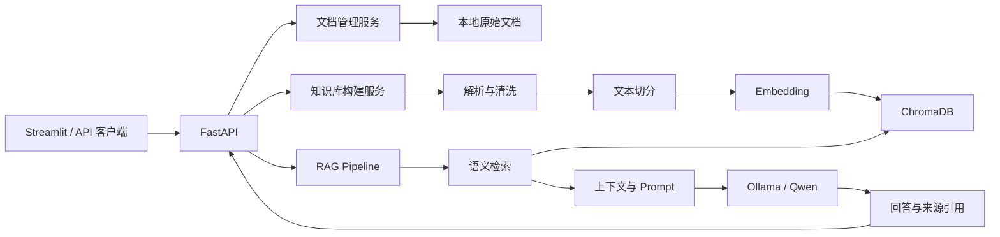

# KnowledgeFlow AI

企业级智能知识库问答系统（Retrieval-Augmented Knowledge Base Assistant）。

KnowledgeFlow AI 可以读取 PDF、TXT 和 Markdown 文档，手动完成文本清洗、切分、向量化、ChromaDB 持久化检索，并调用本地 Ollama/Qwen 生成带来源引用的回答。项目没有用 LangChain 隐藏核心流程，适合学习 RAG 原理、展示 Python 工程能力和参加 AI 应用岗位面试。

## 核心能力

- 文档管理：上传、列表、更新、删除 PDF/TXT/Markdown，保留文档 ID、类型和 PDF 页码。
- 手写 RAG：清洗、滑动窗口切分、Embedding、Top-K 检索、阈值过滤、上下文构建和拒答。
- 本地模型：使用 `intfloat/multilingual-e5-small` 生成中英文向量，使用 Ollama `qwen3:4b` 回答。
- 可追溯回答：返回文档名、页码、Chunk ID、相似度和原文片段。
- 工程能力：集中配置、轮转日志、统一异常、依赖容器、数据持久化、类型注解和测试。
- 产品入口：FastAPI REST API、Swagger 在线文档和 Streamlit 轻量界面。
- 质量评估：带标签的小型数据集、Recall@K、Top-1 来源准确率、拒答准确率和检索延迟。

## 系统架构



### 一次提问的数据流

```text
用户问题
  -> E5 查询向量
  -> ChromaDB Top-K 相似检索
  -> 最低分数过滤
  -> 带文档名、页码的上下文
  -> 防编造 Prompt
  -> Qwen 本地生成
  -> 结构化答案和来源列表
```

更详细的职责划分和逐文件说明见 [架构文档](docs/ARCHITECTURE.md)，简历写法和面试问答见 [面试指南](docs/INTERVIEW_GUIDE.md)。

## 技术栈

| 层 | 技术 | 作用 |
|---|---|---|
| 语言 | Python 3.14.6 | 项目开发语言 |
| API | FastAPI、Uvicorn、Pydantic | HTTP 服务、参数校验、自动文档 |
| 文档 | PyMuPDF | 按页提取 PDF 文本 |
| 向量 | sentence-transformers、multilingual-e5-small | 中英文语义向量 |
| 存储 | ChromaDB | 向量、文本和元数据持久化 |
| 生成 | Ollama、Qwen3 4B | 本地大模型推理 |
| UI | Streamlit | 上传、构建和问答界面 |
| 测试 | pytest、FastAPI TestClient | 单元与 API 集成测试 |

## 项目目录

```text
knowledgeflow-ai/
├── app/
│   ├── api/          # HTTP 路由与请求/响应模型
│   ├── core/         # 配置、日志、异常和依赖装配
│   ├── models/       # 跨层传递的数据模型
│   ├── rag/          # 切分、向量、检索、Prompt、RAG 流程
│   └── services/     # 文档、知识库和 Ollama 服务
├── data/examples/    # 可公开提交的演示文档
├── evaluation/       # 评估数据集和实测基线
├── scripts/          # 命令行检索和评估工具
├── tests/            # 自动化测试
├── docs/             # 架构与面试材料
├── frontend.py       # Streamlit 入口
├── main.py           # ASGI 入口
├── requirements.txt  # 运行时直接依赖
└── Dockerfile        # API 容器构建说明
```

`data/raw`、`data/vector_store`、`logs`、`.env` 和模型缓存不会提交到 GitHub，避免泄露文档、提交大文件或混入机器专属状态。

## Windows 本地运行

### 1. 创建环境并安装依赖

在项目根目录用 PowerShell 执行：

```powershell
py -3.14 -m venv .venv
.\.venv\Scripts\Activate.ps1
python -m pip install --upgrade pip
python -m pip install -r requirements.txt
Copy-Item .env.example .env
```

第一次加载 Embedding 模型需要联网下载模型文件，之后会使用本机缓存。

### 2. 准备 Ollama

安装并启动 Ollama 后执行：

```powershell
ollama pull qwen3:4b
ollama list
```

默认 API 地址是 `http://localhost:11434`。显存不足时 Ollama 会部分使用内存，速度可能下降，但不影响系统结构。

### 3. 启动后端

```powershell
python -m uvicorn main:app --reload
```

- 健康检查：<http://localhost:8000/api/v1/health>
- Swagger：<http://localhost:8000/docs>

### 4. 启动前端

另开一个已激活虚拟环境的 PowerShell：

```powershell
python -m streamlit run frontend.py
```

浏览器访问 <http://localhost:8501>，按“上传文档 → 构建知识库 → 提问”的顺序操作。

## API

| 方法 | 路径 | 作用 |
|---|---|---|
| GET | `/api/v1/health` | 检查 API、Ollama 和向量数量 |
| POST | `/api/v1/documents/upload` | 上传一个支持的文档 |
| GET | `/api/v1/documents` | 列出文档 |
| PUT | `/api/v1/documents/{document_id}` | 更新文档并清除旧向量 |
| DELETE | `/api/v1/documents/{document_id}` | 删除文档和对应向量 |
| POST | `/api/v1/knowledge-base/build` | 构建或重建知识库 |
| POST | `/api/v1/chat` | 执行完整 RAG 问答 |

示例：

```powershell
Invoke-RestMethod -Method Post `
  -Uri http://localhost:8000/api/v1/chat `
  -ContentType 'application/json' `
  -Body '{"question":"年假如何申请？"}'
```

## 配置

复制 `.env.example` 为 `.env` 后可调整：

- `CHUNK_SIZE` / `CHUNK_OVERLAP`：片段大小和相邻片段重叠字符数。
- `RETRIEVAL_TOP_K`：最多取回多少个候选片段。
- `RETRIEVAL_MIN_SCORE`：最低相关分数；过低容易误答，过高容易漏答。
- `MAX_CONTEXT_CHARS`：交给大模型的上下文字符上限。
- `MAX_UPLOAD_BYTES`：单文件上传上限，默认 10 MiB。
- `OLLAMA_MODEL`：本地生成模型，默认 `qwen3:4b`。
- `EMBEDDING_DEVICE`：`auto`、`cpu` 或 `cuda`。

生产或新领域数据不能照搬当前阈值，应重新运行评估后校准。

## 测试与评估

安装开发依赖并运行测试：

```powershell
python -m pip install -r requirements-dev.txt
python -m pytest -q
```

运行不调用大模型的检索评估：

```powershell
python -m scripts.evaluate
```

加入 Ollama 生成评估（耗时更长）：

```powershell
python -m scripts.evaluate --with-generation
```

在 10 个演示问题（7 个可回答、3 个应拒答）上的实际检索基线：

| 指标 | 实测值 |
|---|---:|
| Recall@4 | 1.00 |
| Top-1 来源准确率 | 1.00 |
| 无答案拒答准确率 | 1.00 |
| 平均检索延迟 | 24.84 ms |

这些结果只说明当前小型演示集表现，不代表生产效果；硬件、缓存、文档和问题分布都会改变结果。完整记录见 `evaluation/retrieval_baseline.json`。

## Docker（可选）

```powershell
docker build -t knowledgeflow-ai .
docker run --rm -p 8000:8000 `
  -e OLLAMA_BASE_URL=http://host.docker.internal:11434 `
  -v knowledgeflow-data:/app/data `
  knowledgeflow-ai
```

镜像只包含 API，不把 Ollama 模型塞入镜像。Windows 容器通过 `host.docker.internal` 访问宿主机 Ollama。本项目已完成 Dockerfile 静态检查，但当前开发机未安装 Docker，因此没有宣称本机构建通过。

## 安全与工程设计

- 文件扩展名白名单、10 MiB 大小限制和安全文件名处理。
- 文档内容哈希生成稳定 ID，并识别重复内容。
- 更新/删除文档时同步使旧向量失效。
- Prompt 明确要求只根据上下文回答，检索为空时不调用模型直接拒答。
- API 不向客户端暴露本机文件路径，日志不记录文档全文。
- `.env`、上传文档、日志、向量库、虚拟环境和模型文件均被 Git 忽略。

## 已知限制

- 扫描版 PDF 没有文本层时需要 OCR，本版本不会识别图片文字。
- 基础字符切分器不会理解复杂标题层级；这是为了展示最透明的 RAG 流程。
- 单机本地存储适合学习和作品展示，不含多用户权限、分布式任务和云端高可用。
- Prompt Injection 只能降低风险，不能靠一段 Prompt 完全解决。
- 当前评估集规模小，需要按真实业务文档继续扩充。

## 后续方向

- 加入 OCR、表格解析和更成熟的结构化切分策略。
- 增加 reranker，对初次召回结果进行二次排序。
- 扩大评估集，加入 Faithfulness 和 Answer Relevance 评估。
- 比较手写 Pipeline 与 LangChain/LlamaIndex 的开发效率和可控性。
- 在核心稳定后增加身份认证、异步构建进度和可观测性。

## License

本仓库用于学习和作品展示；正式开源前可根据需要补充许可证文件。
